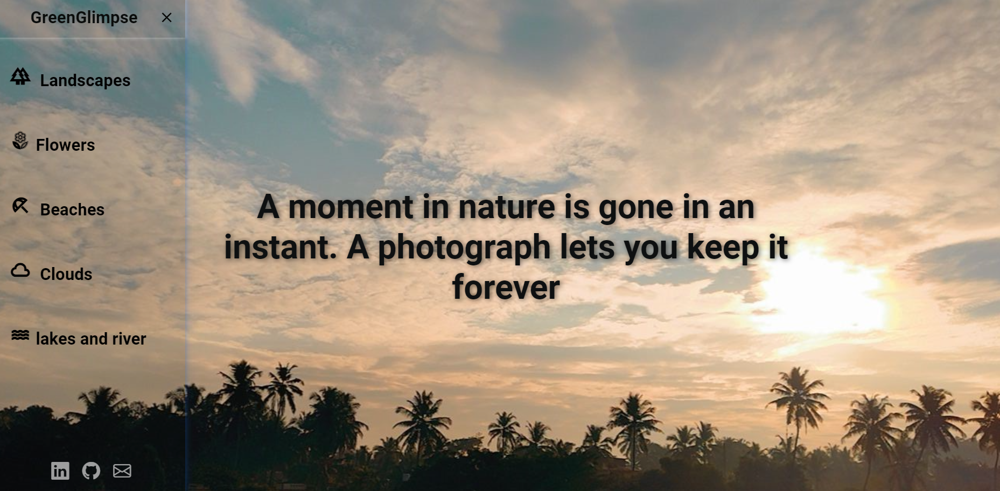

Nature-Themed Photo Gallery-GreenGlimpse

This is a simple static website built using HTML and CSS that displays a photo gallery. 
The gallery is categorized into five main sections: Clouds,Flowers,Landscapes,Beaches,lakes and river.

🌟Features
- Clean homepage with image categories
-Social links: LinkedIn, Mail, GitHub
- Organized folders for different photo types
- Simple and aesthetic design
- Responsive layout (basic CSS)

🛠️Tools Used
- HTML
-CSS
-Bootstrap
-Google Fonts

📸Screenshot

Home Page

